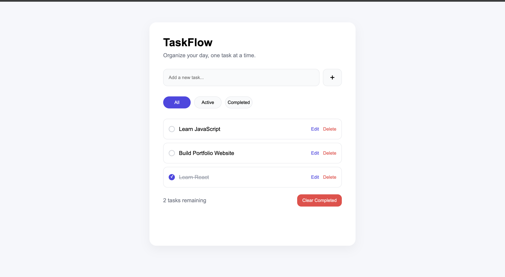
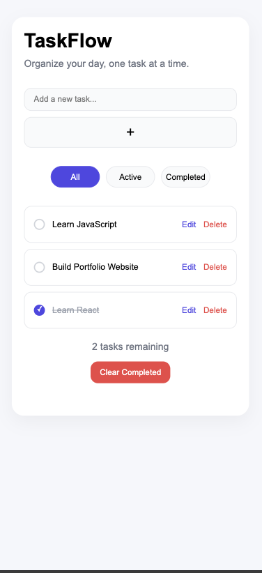

# TaskFlow - Todo App

A clean and responsive Todo application built using **HTML, CSS, and JavaScript**.

TaskFlow helps users organize daily tasks by allowing them to create, edit, complete, filter, and manage tasks with data persistence using the **LocalStorage API**.

## 🌐 Live Demo

[View TaskFlow Live](https://rupeshthapa9700.github.io/taskflow/)

---

## 🚀 Features

* ✅ Add new tasks
* ✅ Prevent empty tasks
* ✅ Remove unnecessary spaces from tasks
* ✅ Edit existing tasks
* ✅ Save edited tasks with Enter key
* ✅ Cancel editing with Escape key
* ✅ Mark tasks as completed
* ✅ Delete tasks
* ✅ Filter tasks:

  * All tasks
  * Active tasks
  * Completed tasks
* ✅ Clear completed tasks
* ✅ Task counter
* ✅ Empty state message
* ✅ Data persistence using LocalStorage
* ✅ Fully responsive design

---

## 🛠️ Technologies Used

* HTML5
* CSS3
* JavaScript (ES6)
* LocalStorage API

---

## 📂 Project Structure

```text
TaskFlow/
│
├── index.html
├── style.css
├── script.js
├── README.md
│
└── screenshots/
    ├── desktop.png
    └── mobile.png
```

---

## 💻 Getting Started

### Clone the repository

```bash
git clone https://github.com/rupeshthapa9700/taskflow.git
```

### Navigate to project folder

```bash
cd taskflow
```

### Run the project

Open:

```text
index.html
```

in your browser.

No installation or dependencies required.

---

## 📸 Screenshots

### Desktop View



---

### Mobile Responsive View



---

## 🌱 Future Improvements

Possible improvements:

* 🌙 Dark mode
* 🖱️ Drag and drop task ordering
* 📅 Task categories and due dates
* 🔔 Task reminders
* 🔐 User authentication
* 🗄️ Backend database integration

---

## 📚 What I Learned

While building this project, I practiced:

* DOM manipulation
* Event handling
* Dynamic HTML creation
* JavaScript arrays and objects
* LocalStorage management
* Responsive CSS design
* Managing application state
* Working with browser APIs

---

## 👨‍💻 Author

**Rupesh Thapa**

GitHub:
https://github.com/rupeshthapa9700

---

## 📄 License

This project is open-source and available under the MIT License.
